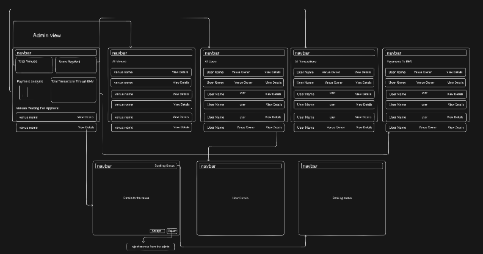

# Admin Workflow

## Overview

The admin dashboard gives BookMyVenue administrators a polished command center to manage the platform, review venue activity, and monitor revenue.

## Key Features

- Total number of venues listed on the platform
- Total registered users and active accounts
- Pending venue approvals requiring admin review
- Total transaction volume processed through the system
- Commission revenue earned by BookMyVenue
- Venue booking status overview
- Performance metrics for each venue
- User controls with action options for support and moderation

## Description

From a single dashboard, the admin can track overall marketplace performance, review new venue requests pending approval, and inspect booking status across venues. The workflow also shows total transactions and commission earned by the platform, helping admins evaluate growth and revenue trends.

The admin can drill down into each venue’s performance matrix, monitor booking activity, and take necessary actions on users or listings. This streamlined interface is designed to make management faster, more attractive, and more efficient.