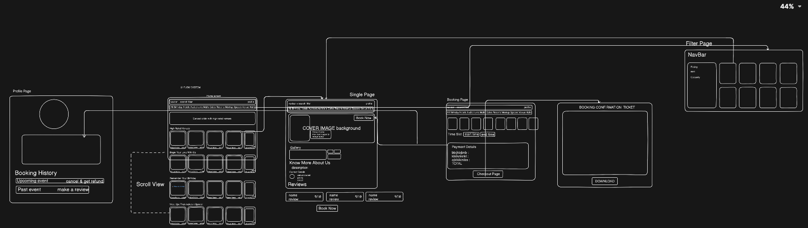

# User Booking Workflow for BookMyVenue

## Overview

The BookMyVenue user journey is designed to be intuitive, polished, and delightful. Users can discover top-rated venues, apply smart filters, explore detailed venue pages, book their ideal location, and manage bookings all in one seamless experience.

## User Experience

- Users land on the homepage and immediately see top-rated venues and curated categories.
- A powerful filter section lets users refine results by price, capacity, location, and more.
- Clicking a venue opens a detailed single venue page with:
  - venue description
  - owner contact details
  - customer reviews
  - clear booking options

## Booking Flow

- From the venue detail page, users go to the booking page.
- They select date and time, and the system checks availability in real time.
- If the venue is available, a payment invoice is generated with:
  - venue price
  - GST
  - final payable amount
- Checkout is handled securely through Dodo Payments.
- After successful payment, the user receives a confirmed booking ticket in PDF format.

## Profile & Booking Management

- The user profile page keeps booking records organized into:
  - Past bookings
  - Upcoming bookings
- For past bookings, users can leave reviews and share feedback.
- For upcoming bookings, users can cancel events if needed.
- Cancellation policies are managed by the venue owner and enforced based on the owner-defined deadline.

## Summary

BookMyVenue brings together inspiration, convenience, and secure booking in a visually appealing workflow. It makes venue discovery fast, booking simple, and event planning stress-free.

