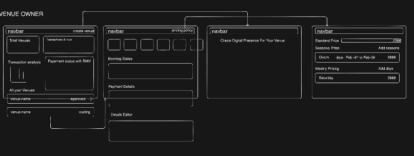

# Venue Owner Workflow

## Overview

Venue owners access a dedicated dashboard designed to simplify listing management and sales tracking.

## Key Features

- **Dashboard summary**
  - Total number of active listings
  - Total transactions completed
  - Transaction metrics and revenue insights
  - Payment status and platform fee summary
- **Listings management**
  - View all listed venues in one place
  - Select any listing to view detailed information and booking status
- **Booking calendar**
  - Click on individual dates to check booking status
  - Monitor availability and reservations at a glance
- **Venue editing**
  - Update venue description and details
  - Manage pricing across multiple date ranges and seasons
- **Flexible pricing manager**
  - Set prices for standard days
  - Configure seasonal pricing periods
  - Adjust rates for weekly or special days
- **Create new venue**
  - Use the Create Venue tab to add a new listing with all required information

## Benefits

This workflow gives venue owners full control over their listings, pricing, and booking activity while providing clear visibility into their platform performance.

